# yfiles

Yandex Disk multiprocessing files loader with download auto strategy.

Now auto files download strategy implemented in yd_files/utils/download_manager.py.
It includes sequential, parallel, background downloading which depends on file size
(threshold 50Mb) and hardware core's number. First testing passed,
docs and user interface are coming soon.

[](https://github.com/cookiecutter/cookiecutter-django/)
[](https://github.com/astral-sh/ruff)

License: MIT

## Settings

Moved to [settings](http://cookiecutter-django.readthedocs.io/en/latest/settings.html).

Форма ввода публичной ссылки Яндекс Диск:

[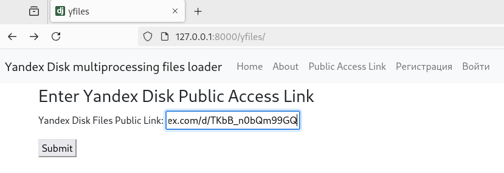]()

Корневой каталог, файлы для загрузки отмечены:

[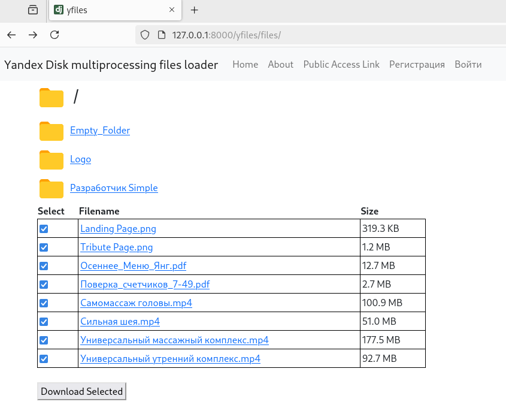]()

Просмотр вложенного каталога:

[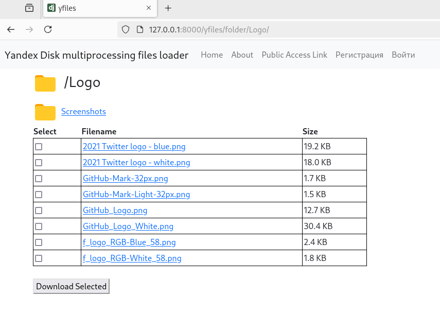]()

Второй уровень вложенности:

[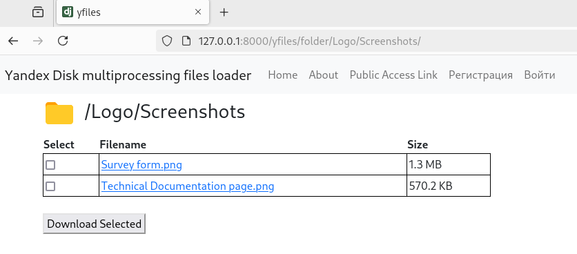]()

Пустая папка:

[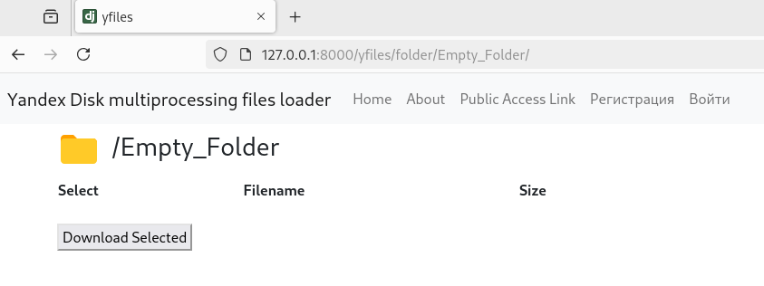]()

Просмотр информации о файле:

[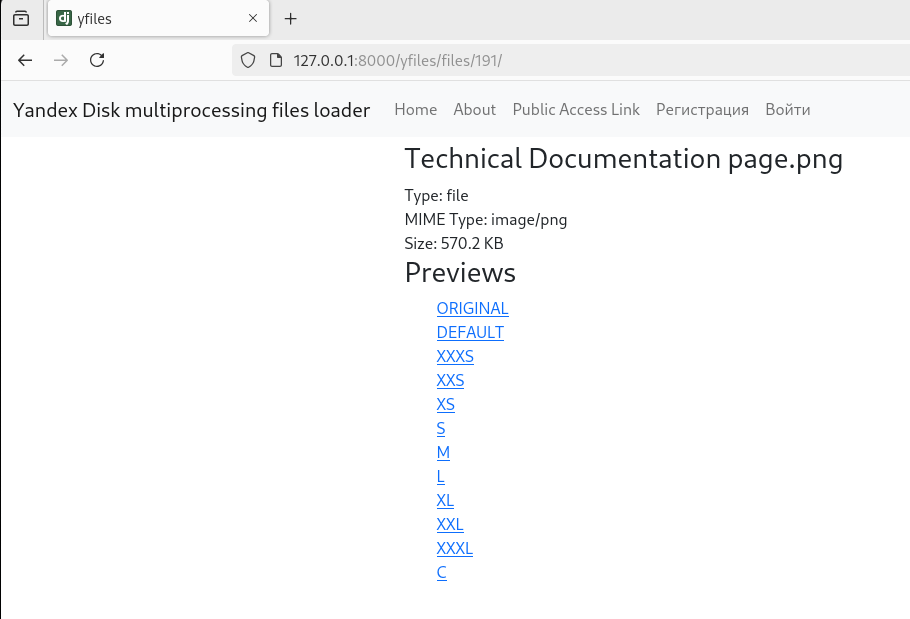]()

Превью файла:

[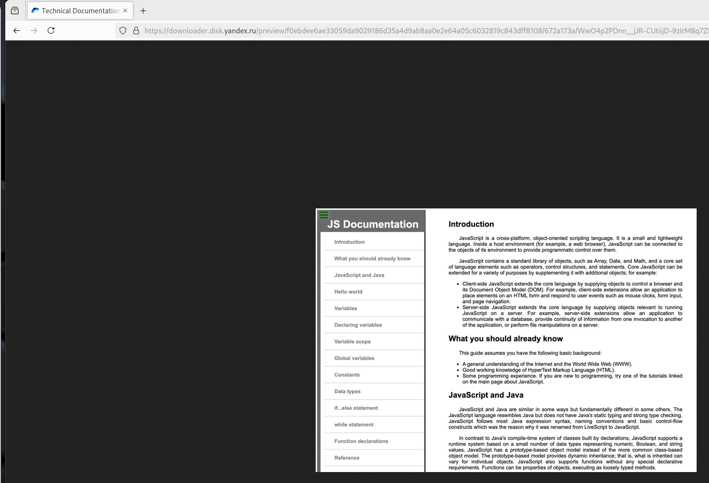]()

CELERY TASKS completed:

[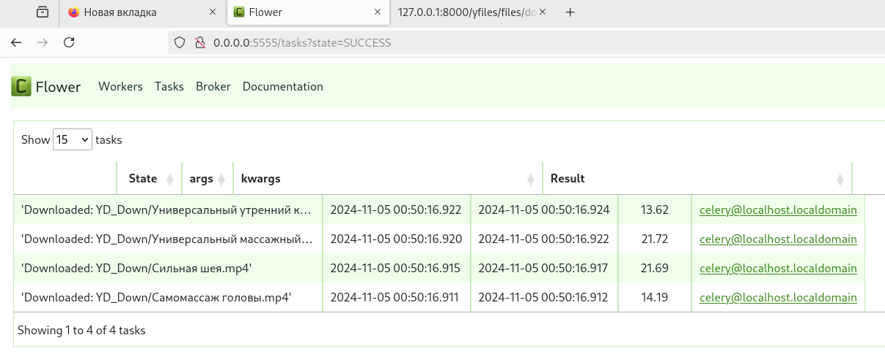]()

Логи:

[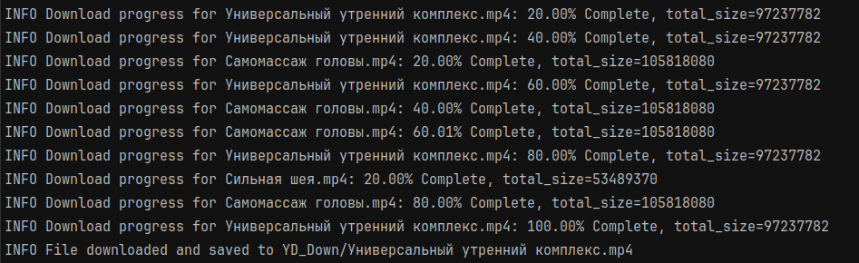]()

[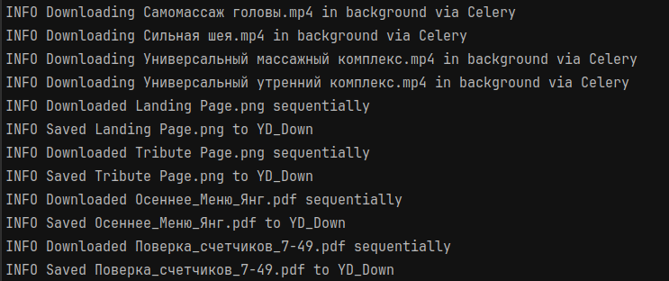]()

Результат:

[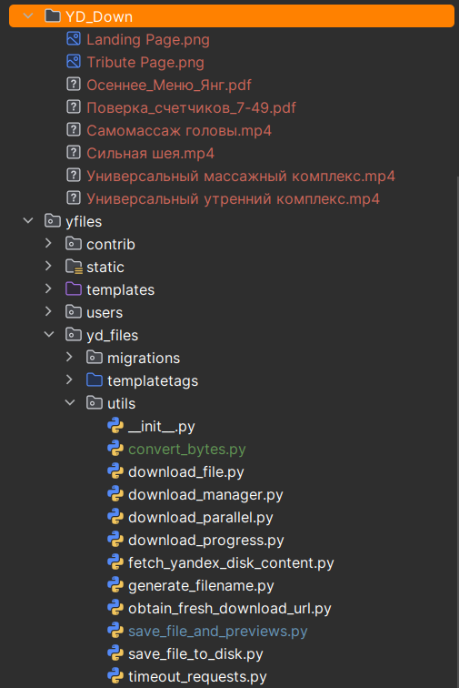]()

## Basic Commands

### Setting Up Your Users

- To create a **normal user account**, just go to Sign Up and fill out the form. Once you submit it, you'll see a "Verify Your E-mail Address" page. Go to your console to see a simulated email verification message. Copy the link into your browser. Now the user's email should be verified and ready to go.

- To create a **superuser account**, use this command:

      $ python manage.py createsuperuser

For convenience, you can keep your normal user logged in on Chrome and your superuser logged in on Firefox (or similar), so that you can see how the site behaves for both kinds of users.

### Type checks

Running type checks with mypy:

    $ mypy yfiles

### Test coverage

To run the tests, check your test coverage, and generate an HTML coverage report:

    $ coverage run -m pytest
    $ coverage html
    $ open htmlcov/index.html

#### Running tests with pytest

    $ pytest

### Live reloading and Sass CSS compilation

Moved to [Live reloading and SASS compilation](https://cookiecutter-django.readthedocs.io/en/latest/developing-locally.html#sass-compilation-live-reloading).

### Celery

This app comes with Celery.

To run a celery worker:

```bash
cd yfiles
celery -A config.celery_app worker -l info
```

Please note: For Celery's import magic to work, it is important _where_ the celery commands are run. If you are in the same folder with _manage.py_, you should be right.

To run [periodic tasks](https://docs.celeryq.dev/en/stable/userguide/periodic-tasks.html), you'll need to start the celery beat scheduler service. You can start it as a standalone process:

```bash
cd yfiles
celery -A config.celery_app beat
```

or you can embed the beat service inside a worker with the `-B` option (not recommended for production use):

```bash
cd yfiles
celery -A config.celery_app worker -B -l info
```

## Deployment

The following details how to deploy this application.

### Docker

See detailed [cookiecutter-django Docker documentation](http://cookiecutter-django.readthedocs.io/en/latest/deployment-with-docker.html).
